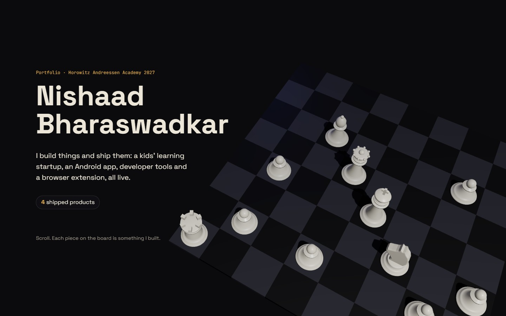
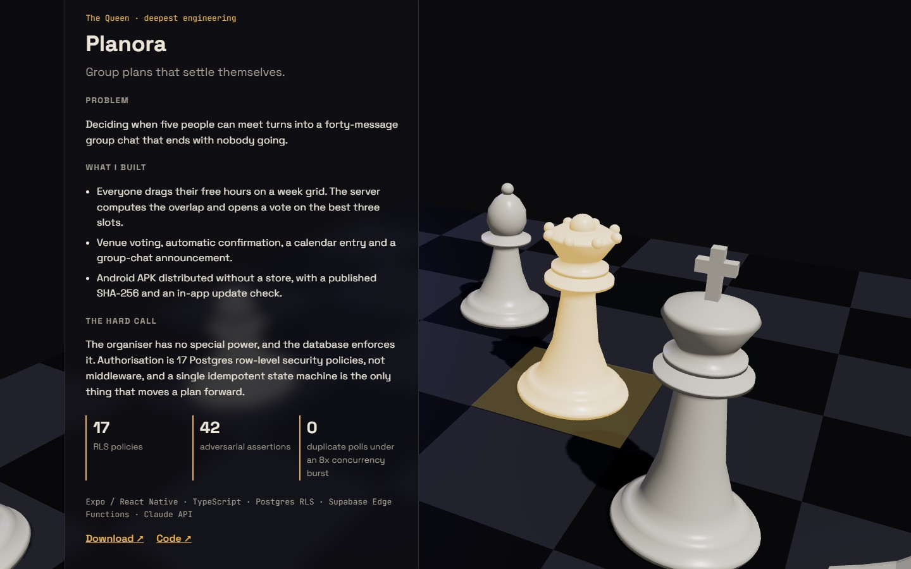

<div align="center">

# Nishaad Bharaswadkar · Portfolio

**A 3D chessboard where every piece is something I built and shipped.**

[**Live site →**](https://nishaad-portfolio.vercel.app)




</div>

---

## The idea

I captained my school chess team, and I think about building the same way: a few moves ahead. Scroll down the page and the camera glides across the board from piece to piece, with a case study for each project.

| Piece | Project | What it is |
|---|---|---|
| ♔ King | [Mentary](https://waitlist-mentary.vercel.app) | Daily brain-training puzzles for kids. The company I'm building |
| ♕ Queen | [Planora](https://github.com/darkaimzzz/planora) | Group scheduling app. Authorisation enforced by 17 Postgres RLS policies, attacked by a 42-assertion audit suite |
| ♖ Rook | [AgentPack](https://github.com/darkaimzzz/AgentPack) | Installs MCP servers across Claude Code, Codex and OpenCode, checks each one responds, rolls back on failure |
| ♘ Knight | [Form Rescue](https://github.com/darkaimzzz/Form-Rescue) | Local-first browser extension that recovers lost form drafts |
| ♗ Bishop | Security research | Three years of Hack The Box and TryHackMe |
| ♙ Pawns | Earlier work | Discord bot (500+ users), trading algorithm, Unity game, Arduino solar systems and more |



## How it's built

- **The content is plain HTML. The 3D is the backdrop.** Every word can be read without WebGL, so the page is crawlable and the text appears before Three.js loads.
- **No model files.** The pieces are generated in code: lathe-turned Staunton profiles, plus an extruded horse head for the knight and battlements for the rook, merged into one geometry per piece.
- **Scroll-driven camera.** An `IntersectionObserver` picks the active section, and the camera eases toward that piece each frame.
- **Lazy-loaded scene.** Three.js sits in its own chunk and loads after first paint. The pixel ratio is capped at 1.5.
- **Accessible fallback.** With `prefers-reduced-motion` or no WebGL, the canvas is skipped and the page renders flat.
- **Live waitlist stat.** It reads Mentary's signup count through a `security definer` Postgres function that returns only a number. The list of emails can't be read with the public key.
- **One data file.** [`src/projects.ts`](src/projects.ts) drives both the board and the panels.

```
src/
├── projects.ts   content: projects, pawns, timeline, roadmap
├── Board.tsx     scene: board, generated pieces, camera rig
├── App.tsx       page sections + scroll tracking
└── index.css     styles
```

## Run it

```bash
npm install
npm run dev       # http://localhost:5173
npm run build     # static output in dist/
```

The live waitlist stat is optional. Set `VITE_SUPABASE_URL` and `VITE_SUPABASE_KEY` (the publishable key). Without them it stays hidden.

<details>
<summary>Supabase function</summary>

```sql
create or replace function public.waitlist_count() returns integer
language sql security definer set search_path = public stable as $$
  select count(*)::int from public.waitlist_active;
$$;
revoke all on function public.waitlist_count() from public;
grant execute on function public.waitlist_count() to anon, authenticated;
```

</details>

## Contact

[nishaadbharaswadkar@gmail.com](mailto:nishaadbharaswadkar@gmail.com) · [GitHub](https://github.com/darkaimzzz)
